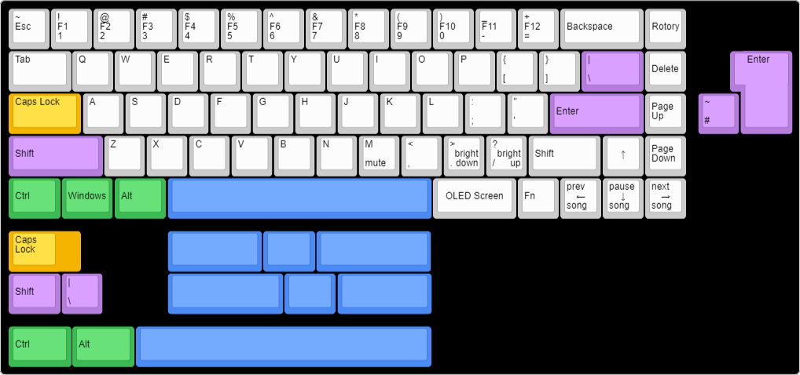
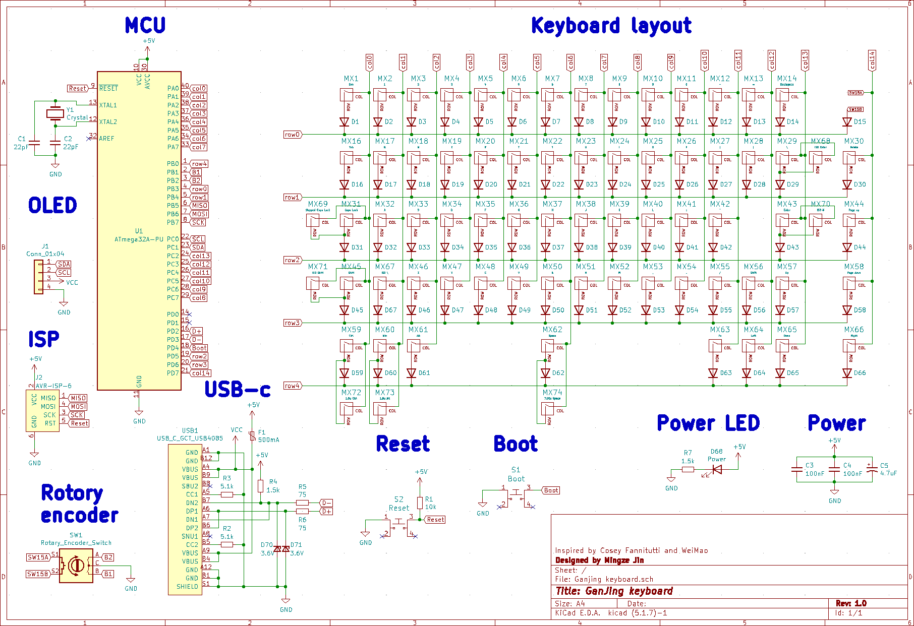

# GanJing-keyboard
**A 65% keyboard with a rotary encoder, OLED screen and USB-c. Made using only through-hole components for easy soldering.**

## Layout options
The GanJing keyboard supports ISO layouts, as well as stepped caps lock keys. The bottom row also supports alternate layouts.

## Schematic
Inspired by the [Discipline](https://github.com/coseyfannitutti/discipline) and [Pheromone](https://github.com/luantty2/pheromone_keyboard) keyboards.

